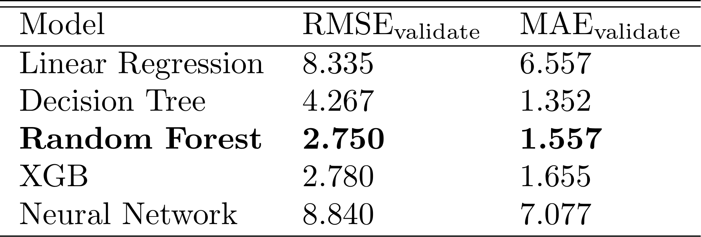
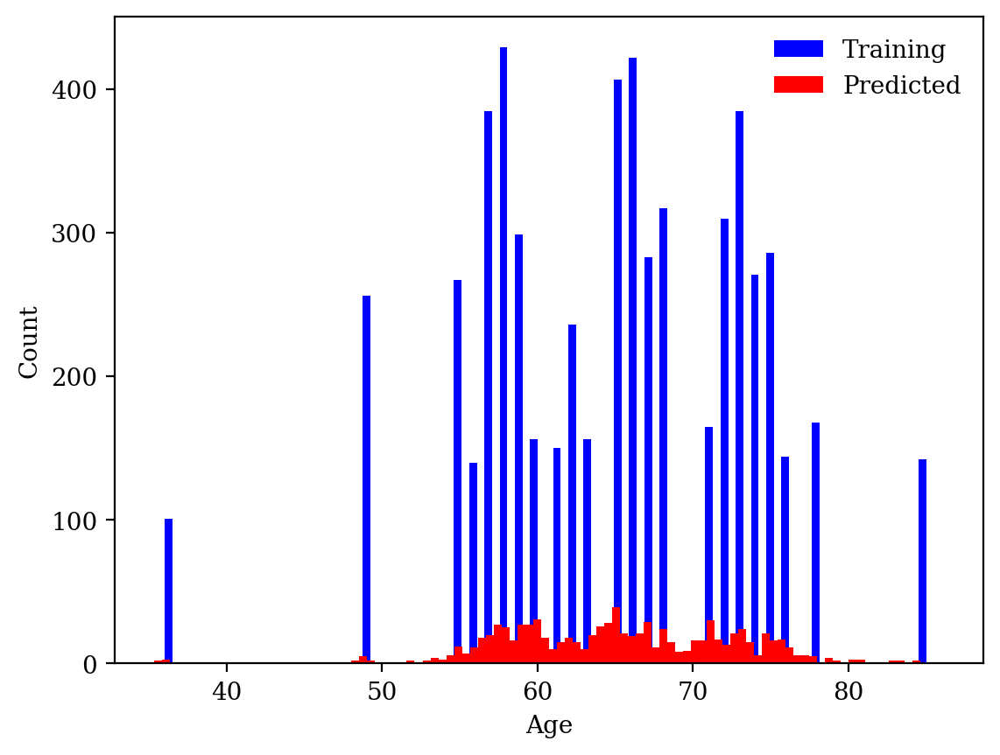

# Streamlit_ML
Within this Streamlit application, we employ machine learning algorithms to predict the age of individuals who have a high likelihood of developing Parkinson's Disease. Our best model was the eXtreme Gradient Boost (XGB), due to its low RMSE and MAE score.

Application can be found here: https://arosenswie-streamlit-ml-miniproject-app-6xu6kx.streamlit.app/.

Presented below is a histogram comparing the ages of the training dataset to the predicted ages generated by the XGB model using the validation set.

Please note that this example is not intended for medical use.
